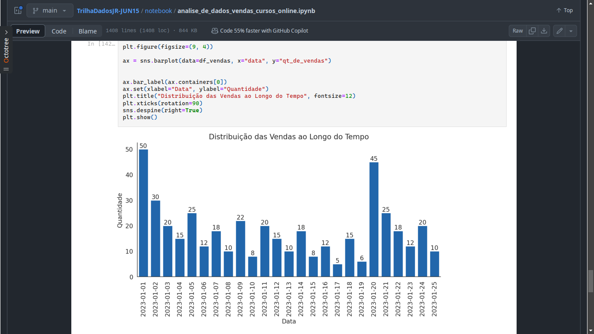
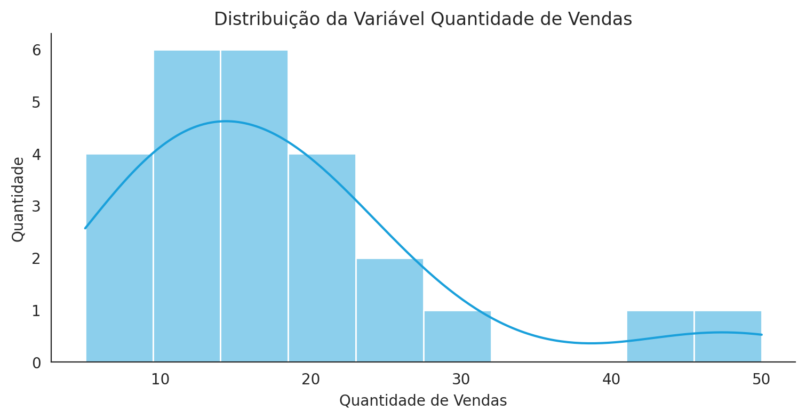
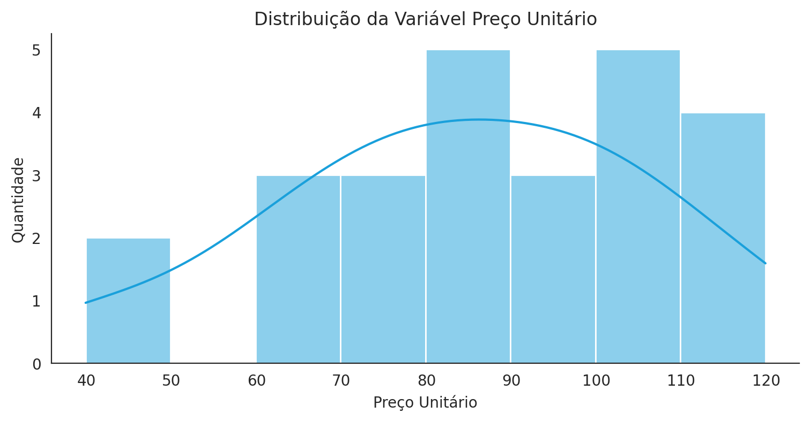
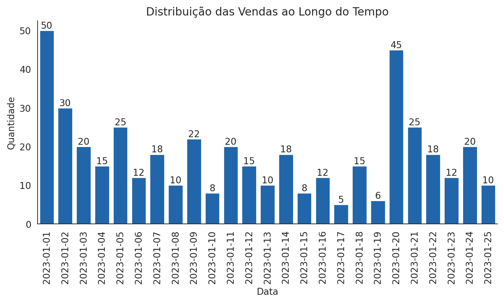
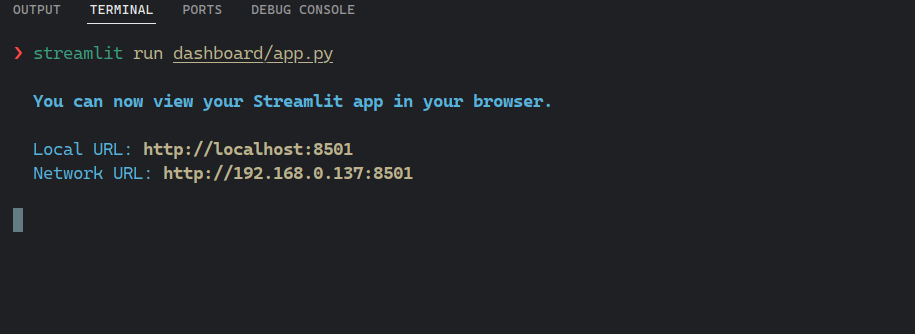
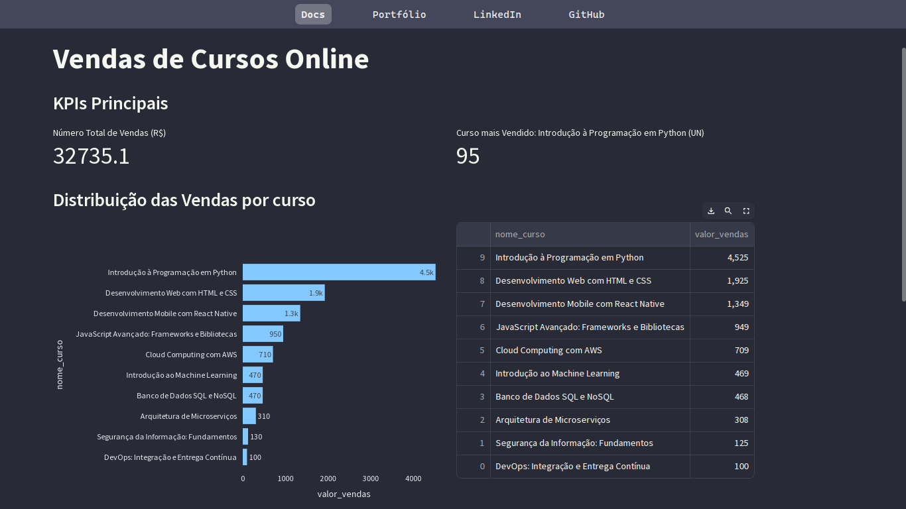

<p align=center>          
  </ul>
  <br> <br>
</p>


<p align="center">
  
  <br>
</p>


<!-- <p align="center">
   &
  
</p> -->


# 📚 Trilha Inicial Ciência de Dados Jr
Este projeto tem como objetivo realizar uma análise básica de dados utilizando Python, explorando um conjunto de dados pré-definido para extrair insights simples através de estatísticas descritivas e visualizações gráficas.


---

## Requisitos

>> 1. python = "^3.10"
>> 2. notebook = "^7.2.1"
>> 3. pip ou poetry

---

## Como executar o Projeto

Para usar o projeto você deve criar um ambiente virtual do Python, para isso você deve ter instalado em seu computador o pyenv, virtualenv ou poetry.

Obs: Copie apenas o texto, sem o simbolo ❯.


### Com venv do Python

```bash
❯ python -m venv .venv

# Ativando o ambiente no Windows
❯ source .venv/bin/activate

# Ativando o ambiente no Linux e Mac
❯ source .venv/bin/activate

❯ pip install -r requirements.txt
```


### Com Poetry

```bash
# Ativando a virtual env
❯ poetry shell

# instalando as dependências
❯ poetry install
```


# Solução do Case

### Notebook 

Para solucionar o case foi usado o Jupyter notebook, para ter acesso a análise exploratória completa [Click aqui](https://github.com/Oseiasdfarias/TrilhaDadosJR-JUN15/blob/main/notebook/analise_de_dados_vendas_cursos_online.ipynb) ou acesse a pasta `notebook` este repositório. A análise possui explicações para cada célula de código implementada no notebbok.

<p align="center">
  
</p>

#### Resumo da Análise Exploratória

+ ***Visualização do DataFrame usando o método `head()`.***

 ```python
  df_vendas.head()
 ```

|   | ID | Nome do Curso                                 | Quantidade de Vendas | Preço Unitário | Data       |
|---|----|-----------------------------------------------|----------------------|----------------|------------|
| 0 | 1  | Introdução à Programação em Python            | 50                   | 39.9           | 2023-01-01 |
| 1 | 2  | Desenvolvimento Web com HTML e CSS            | 30                   | 59.9           | 2023-01-02 |
| 2 | 3  | JavaScript Avançado: Frameworks e Bibliotecas | 20                   | 79.9           | 2023-01-03 |
| 3 | 4  | Introdução ao Machine Learning                | 15                   | 99.9           | 2023-01-04 |
| 4 | 5  | Desenvolvimento Mobile com React Native       | 25                   | 69.9           | 2023-01-05 |


 + ***Obtendo o detalhamento do DataFrame usando o método `info()`.***

 ```python
  df_vendas.info()
 ```

```
<class 'pandas.core.frame.DataFrame'>
RangeIndex: 25 entries, 0 to 24
Data columns (total 5 columns):
 #   Column                Non-Null Count  Dtype  
---  ------                --------------  -----  
 0   ID                    25 non-null     int64  
 1   Nome do Curso         25 non-null     object 
 2   Quantidade de Vendas  25 non-null     int64  
 3   Preço Unitário        25 non-null     float64
 4   Data                  25 non-null     object 
dtypes: float64(1), int64(2), object(2)
memory usage: 1.1+ KB
```


 + ***Obtendo resumo estatístico da base de dados para as columas `Quantitativas`***

 ```python
  df_vendas.describe()
 ```

|       | ID        | Quantidade de Vendas | Preço Unitário |
|-------|-----------|----------------------|----------------|
| count | 25.000000 | 25.000000            | 25.000000      |
| mean  | 13.000000 | 17.960000            | 83.900000      |
| std   | 7.359801  | 10.921996            | 21.984843      |
| min   | 1.000000  | 5.000000             | 39.900000      |
| 25%   | 7.000000  | 10.000000            | 69.900000      |
| 50%   | 13.000000 | 15.000000            | 79.900000      |
| 75%   | 19.000000 | 20.000000            | 99.900000      |
| max   | 25.000000 | 50.000000            | 119.900000     |


+ ***Distribuição da Variável Quantidade de Vendas***

```python
plt.figure(figsize=(9, 4))
cores = ["#0A66C2", "#ECF7AE", "#1AA0DB", "#8BD5DB"]
sns.set_palette(sns.color_palette(cores))
ax= sns.histplot(df_vendas["qt_de_vendas"], bins=10, kde=True, color=cores[-2])
sns.despine(right=True)

plt.title("Distribuição da Variável Quantidade de Vendas", fontsize=12)
plt.xlabel("Quantidade de Vendas")
plt.ylabel("Quantidade")
plt.show()
```

<p align="center">
<br>
  
</p>


+ ***Distribuição da Variável Preço Unitário***

```python
plt.figure(figsize=(9, 4))
sns.set_palette(sns.color_palette(cores))
ax= sns.histplot(df_vendas["preco_unitario"], bins=8, kde=True, color=cores[-2])
sns.despine(right=True)

plt.title("Distribuição da Variável Preço Unitário", fontsize=12)
plt.xlabel("Preço Unitário")
plt.ylabel("Quantidade")
plt.show()
```

<p align="center">
<br>
  
</p>


+ ***1. Calcular a receita total gerada pela venda dos cursos.***


```python
print(f"Receita Total das Vendas: {np.sum(df_vendas.qt_de_vendas*df_vendas.preco_unitario):.2f}")
```

Saída:

```
Receita Total das Vendas: 32735.10
```


+ ***2. Identificar o curso com o maior número de vendas.***

```python
df_qt_vendas = (df_vendas.groupby("nome_curso")["qt_de_vendas"]
 .sum()
 .sort_values(ascending=False)
 .to_frame()
 .reset_index())
df_qt_vendas

print(f"Curso com o maior número de vendas| {df_qt_vendas.nome_curso[0]} | Qt: {df_qt_vendas.qt_de_vendas[0]}")

```

Saída:

```
Curso com o maior número de vendas| Introdução à Programação em Python | Qt: 95

```


+ ***3. Visualizar a distribuição das vendas ao longo do tempo através de gráficos.***

```python
plt.figure(figsize=(9, 4))

ax = sns.barplot(data=df_vendas, x="data", y="qt_de_vendas")


ax.bar_label(ax.containers[0])
ax.set(xlabel="Data", ylabel="Quantidade")
plt.title("Distribuição das Vendas ao Longo do Tempo", fontsize=12)
plt.xticks(rotation=90)
sns.despine(right=True)
plt.show()
```

<p align="center">
<br>
  
</p>

### Pré-Processamento dos Dados 

Além da análise exploratória dos dados, foi implementado um scritp python para o pré-processamento dos dados afim de ser consumido por um Dashboard, o script está no pasta `src` que realiza as seguintes transformações.


1. Renovea as colunas para facilitar o uso em códigos;
2. Converte a coluna `Data` no tipo `datetime`;
3. Cria uma nova coluna `valor_vendas`, contendo os valores de venda;
4. Salva os dados tratado no subpasta `data/gold`.


Para executar o código, basta entrar na pasta do projeto, ativar o ambiente virtual via terminal e executar o seguinte comando:


```bash
❯ python src/processamento_database.py 
```


##### Código completo

```python
import pandas as pd


df_vendas = pd.read_csv("./data/silver/dados_vendas_cursos_online.csv")


df_vendas = df_vendas.rename(columns={
    "Nome do Curso": "nome_curso",
    "Quantidade de Vendas": "qt_de_vendas",
    "Preço Unitário": "preco_unitario",
    "Data": "data"})


df_vendas["data"] = pd.to_datetime(df_vendas["data"], format='%Y-%m-%d')

print(f"Tipo do dado após conversão: {df_vendas['data'].dtypes}")
print(f"Amostrar para visualização {df_vendas['data'][1]}")


df_vendas["valor_vendas"] = df_vendas.qt_de_vendas*df_vendas.qt_de_vendas


df_vendas.to_csv("./data/gold/tratados_dados_vendas_cursos_online.csv",
                 index=False)

```


### Dashboard

Por fim, foi implementado um Dashboard usando `Streamlit` para melhor visualização dos insights.

Para executar o código, basta entrar na pasta do projeto, ativar o ambiente virtual via terminal e executar o seguinte comando:


```bash
❯ streamlit run dashboard/app.py
```

Se tudo ocorrer corretamente terá o seguinte log em seu terminal e o Dashboard irá abrir em seu navegador padrão.


> **LOG no terminal**

<p align="center">
  
</p>


> **Dashboard em Execução**

<p align="center">
  
</p>


---


<p align="center">
<br>
  
</p>


---

<h3  id="id9">🎥 Rede Social</h3>

<p align=center> <a href="https://oseiasfarias.info"></a> <a href="https://www.linkedin.com/in/oseiasfarias/"></a>
<a href="https://oseiasfarias.medium.com"></a>
<a href="https://www.kaggle.com/osiasdfarias"></a>
</p>